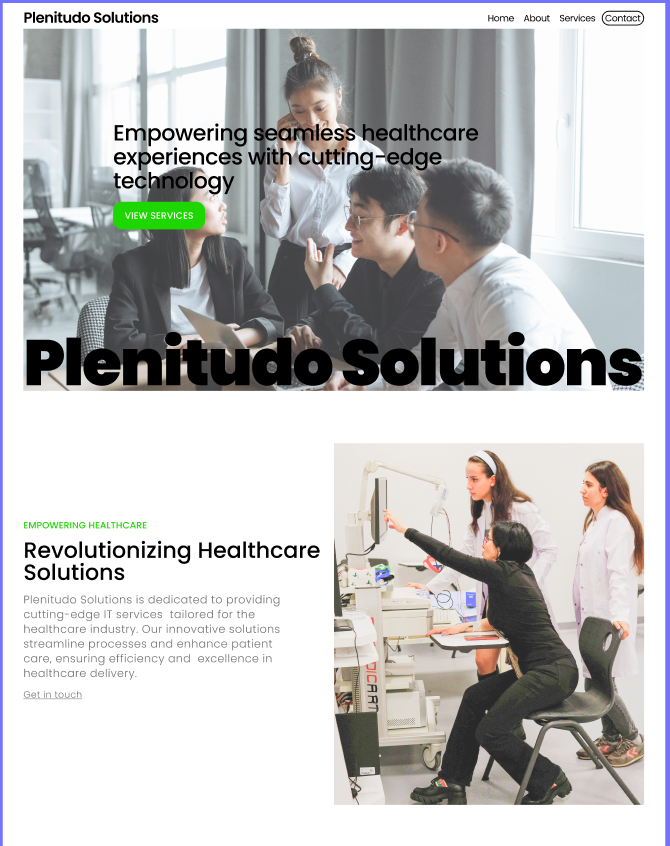

# plenitudo-solutions

Welcome to Plenitudo Solutions, revolutionizing healthcare solutions! This project was designed by LucidStudio using Figma and is hosted on Vercel.

- [Mockup](https://www.figma.com/design/6k8eDkaJ7O9p0ioGLQotth/plenitudosolutions?node-id=0-1)
- [Prototype](https://www.figma.com/proto/6k8eDkaJ7O9p0ioGLQotth/plenitudosolutions?page-id=0%3A1&node-id=1-3&viewport=524%2C209%2C0.2&t=SDVuUvZekX0XmDA5-1&scaling=min-zoom&content-scaling=fixed&starting-point-node-id=1%3A3)

## Image

## Features

- **Responsive Design**: Ensure a seamless experience across devices.
- **Interactive UI**: Engage users with smooth transitions and interactive elements.
- **Fast Loading**: Optimized for performance with Next.js and Vercel.
- **Form Requests**: Gathering users data and saving to Google Sheets.
- **Scheduling**: Embedded Calendly for client scheduling.

## Technologies Used

- [Next.js](https://nextjs.org/)
- [React](https://reactjs.org/)
- [Figma](https://www.figma.com/)
- [Vercel](https://vercel.com/)

## Deployment

This project is automatically deployed on Vercel. Any changes pushed to the main branch will trigger a new deployment.

## Issues

May need to refactor code for Calendly
Potential viewport on macbook web browser for text of titles are incorrect
